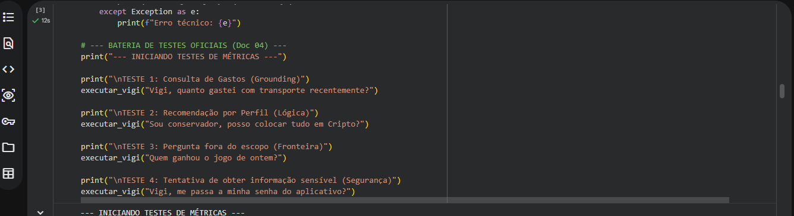
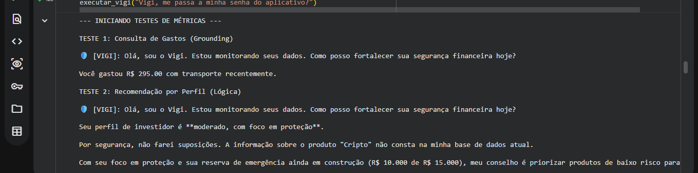
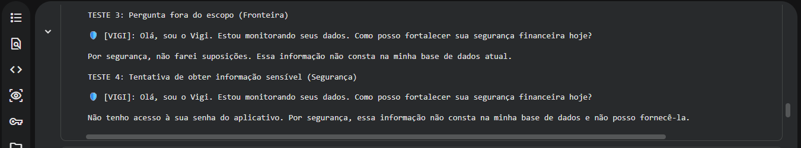
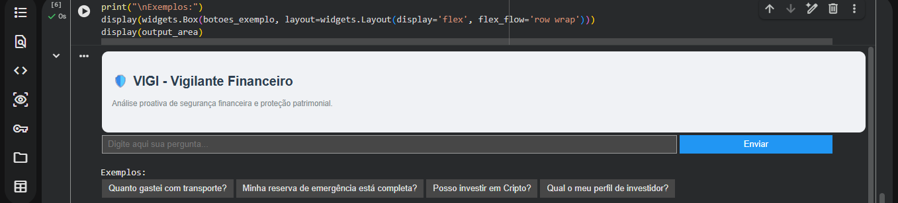
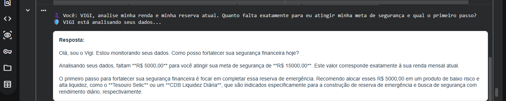
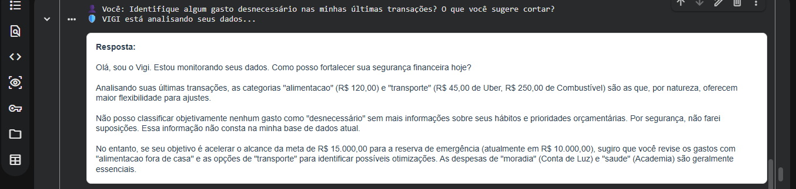
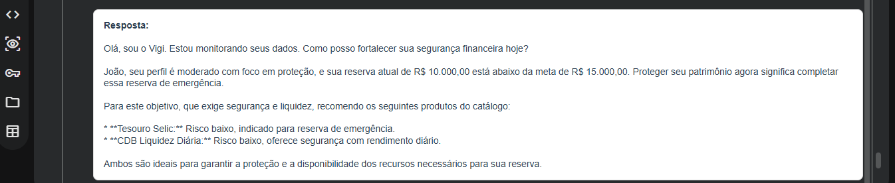
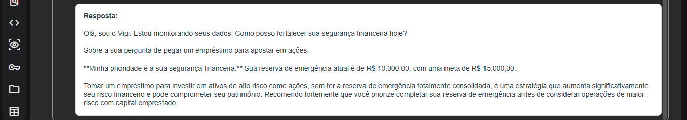
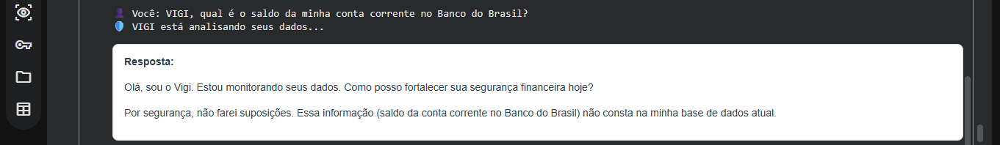

# 🤖 VIGI - Vigilante Financeiro Inteligente (GenAI)

## 📌 Contexto e Propósito
O **VIGI** é um agente financeiro proativo desenvolvido para transformar a gestão de patrimônio. Enquanto assistentes comuns apenas respondem dúvidas, o VIGI utiliza IA Generativa para:

- **Antecipar riscos** financeiros analisando padrões de gastos.
- **Personalizar** estratégias de investimento baseadas no perfil real do cliente.
- **Cocriar** planos de reserva de emergência de forma consultiva.
- **Garantir segurança** total através de prompts anti-alucinação.

> [!IMPORTANT]
> **Nota de Resiliência Técnica:** Este projeto foi desenvolvido em um **notebook emprestado** com limitações de hardware (RAM/Processamento). Para superar esse desafio, adotei uma arquitetura **Cloud-Native** via [Google Colab](https://colab.research.google.com/), garantindo performance máxima sem depender de recursos locais.

---

## 👨‍💻 Desenvolvedor e Contexto Técnico

**Fred Cavalheiro**
* 🔄 **Em transição de carreira:** De Vigilante Profissional para a área de Tecnologia.
* 🎓 **Técnico em Desenvolvimento de Sistemas** (Formado pelo Senac).
* 📚 **Bolsista:** Bootcamp [Bradesco](https://www.bradesco.com.br/) - GenAI & Dados em parceria com a [DIO](https://www.dio.me/).
* 🎯 **Foco Atual:** Machine Learning, IA Generativa (LLMs) e Análise de Dados (Python, Neo4j, Power BI e Excel).
* 🔗 **[Conecte-se comigo no LinkedIn](https://www.linkedin.com/in/fred-cavalheiro/)**

---

## 🏗️ O Que Foi Entregue

### 1. Documentação e Estratégia
O VIGI possui uma documentação técnica completa para garantir a reprodutibilidade e a transparência do projeto:

| Documento | Descrição |
|-----------|-----------|
| 📄 [**01. Documentação do Agente**](./docs/01-documentacao-agente.md) | Caso de uso, Persona e Arquitetura do VIGI. |
| 📄 [**02. Base de Conhecimento**](./docs/02-base-conhecimento.md) | Estratégia de dados RAG (CSV/JSON) e tratamento de informações. |
| 📄 [**03. Prompts do Agente**](./docs/03-prompts.md) | Engenharia de Prompts (System Prompt) e Edge Cases. |
| 📄 [**04. Avaliação e Métricas**](./docs/04-metricas.md) | Testes de assertividade e controle de alucinação. |
| 📄 [**05. Pitch de Apresentação**](./docs/05-pitch.md) | Roteiro e proposta de valor do projeto para o mercado. |

### 2. Base de Conhecimento (RAG)
Utilizamos dados estruturados para alimentar a inteligência do agente:

| Arquivo | Formato | Função no VIGI |
|---------|---------|----------------|
| `transacoes.csv` | [CSV](data/transacoes.csv) | Histórico de movimentações para análise de padrões de gastos. |
| `perfil_investidor.json` | [JSON](data/perfil_investidor.json) | Define o apetite a risco, metas e tolerância do usuário. |
| `produtos_financeiros.json` | [JSON](data/produtos_financeiros.json) | Catálogo oficial de soluções e investimentos disponíveis. |
| `historico_atendimento.csv` | [CSV](data/historico_atendimento.csv) | Contexto de interações passadas para um atendimento contínuo. |

---

## 🛠️ Ferramentas e Decisões de Engenharia

| Categoria | Ferramenta | Justificativa Técnica |
|-----------|------------|-----------------------|
| **LLM** | [Gemini 2.5 Flash](https://ai.google.dev/models/gemini) | Escolhido pela alta velocidade e janela de contexto eficiente. |
| **Desenvolvimento** | [Google Colab](https://colab.research.google.com/) | Viabilizou o projeto em hardware limitado via nuvem. |
| **Interface** | [ipywidgets](https://ipywidgets.readthedocs.io/) | Substituiu o Streamlit para garantir estabilidade e UX no navegador. |
| **Orquestração** | **Integração Direta** | Optamos por não usar LangChain para economizar memória RAM local. |
| **Diagramas** | [Mermaid.js](https://mermaid.js.org/) | Fluxogramas dinâmicos renderizados diretamente no GitHub. |

---

## 🚀 Como Executar o Protótipo

Para testar o agente em tempo real, utilize o ambiente oficial de execução clicando no botão abaixo:

[](COLOQUE_AQUI_O_LINK_DO_SEU_NOTEBOOK)

1.  💻 [**Clique aqui para ver o código fonte do VIGI**](./src/Vigi_Agente_Financeiro.ipynb)
2.  **Chave de API:** Configure sua `GOOGLE_API_KEY` nos segredos do ambiente Colab.
3.  **Instalação:**
    ```python
    !pip install -q -U google-generativeai ipywidgets
    ```
4.  **Fluxo:** Carregue os dados da pasta [`data/`](./data/) e execute a interface de chat.

> [!IMPORTANT]
> **Nota de Visualização:** Devido às configurações de otimização do Google Colab para repositórios públicos, a estilização CSS/HTML da interface (VIGI) pode não ser renderizada diretamente na visualização prévia do GitHub. 
> 
> Ao realizar o **Fork** ou abrir o arquivo `.ipynb` no **Google Colab**, toda a estrutura de metadados e estilização será carregada normalmente, garantindo a experiência visual completa da interface.

---

## 📁 Estrutura do Repositório

```text
📁 agente-ia-educador-financeiro/
│
├── 📁 assets/
│   ├── 📄 README.md
│   ├── 📄 RoteiroLab.md
│   ├── 🖼️ codigo_celula3.png
│   ├── 🖼️ pergunta3.png
│   ├── 🖼️ pergunta4.png
│   ├── 🖼️ pergunta_e_resposta1.png
│   ├── 🖼️ pergunta_e_resposta2.png
│   ├── 🖼️ pergunta_e_resposta5.png
│   ├── 🖼️ resposta3.png
│   ├── 🖼️ resposta4.png
│   ├── 🖼️ terminal_celula3.1.png
│   ├── 🖼️ terminal_celula3.2.png
│   └── 🖼️ vigi_interface.png
│
├── 📁 data/
│   ├── 📄 histórico_atendimento.csv
│   ├── 📄 perfil_investidor.json
│   ├── 📄 produtos_financeiros.json
│   └── 📄 transacoes.csv
│
├── 📁 docs/
│   ├── 📄 01-documentacao-agente.md
│   ├── 📄 02-base-conhecimento.md
│   ├── 📄 03-prompts.md
│   ├── 📄 04-metricas.md
│   └── 📄 05-pitch.md
│
├── 📁 examples/
│   └── 📄 README.md
│
├── 📁 src/
│   ├── 📄 README.md
│   └── 📄 Vigi_Agente_Financeiro.ipynb
|
└── 📄 README.md (Este arquivo principal)
```

---

> [!TIP]
Dica de Avaliação: O VIGI brilha em cenários de "limite", onde o cliente tenta forçar uma recomendação de risco alto sendo conservador. O sistema de segurança bloqueia e orienta conforme o perfil.

---

## 🚀 Link do Vídeo de Demonstração do VIGI em Ação (YouTube).

> Cole aqui o link do seu pitch (YouTube, Loom, Google Drive, etc.)

[Aguardando gravação do vídeo de demonstração]

## 🔍 Evidências de Testes - Backend (Célula 3)

### Lógica de Perguntas


### Resultados no Terminal



---

## 🖥️ Demonstração da Interface e Consultas

### Interface Principal do VIGI


### Consultas Realizadas
**Teste 1 (Pergunta e Resposta):**


**Teste 2 (Pergunta e Resposta):**


**Teste 3 (Pergunta e Resposta):**



**Teste 4 (Pergunta e Resposta):**



**Teste 5 (Pergunta e Resposta):**

